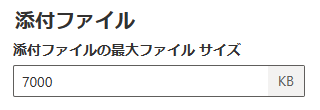
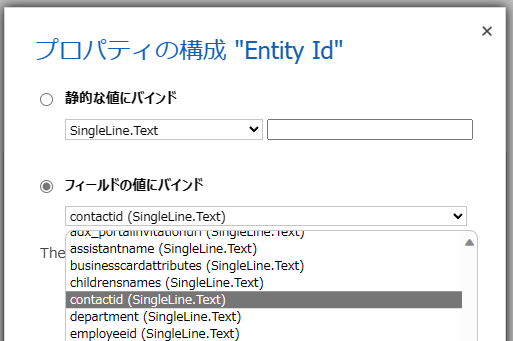
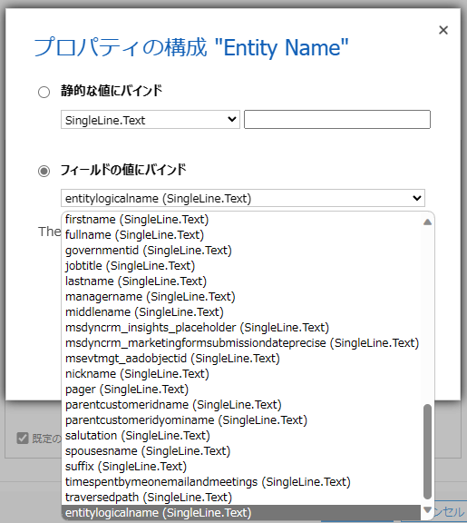
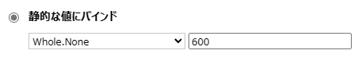
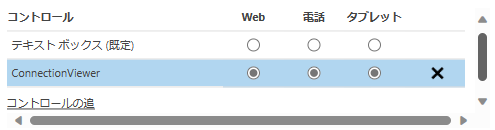
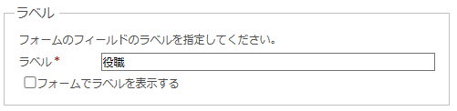

# セットアップ方法

1. 本 PCF コントロールは、モデル駆動型アプリのフォーム上でのみ動作します。キャンバス アプリでは動作しません。
1. このリポジトリの [Releases](https://github.com/keijiinouehotmail/DataverseConnectionViewerPCF/releases) にある最新のソリューションファイル (.zip) をダウンロードします。
1. カスタマイズ権限を持つユーザーで [https://make.powerapps.com/ ↗️](https://make.powerapps.com/) にて、適切な環境を選び、ソリューションファイルをインポートします。
    - もしここで、以下のようなエラーが表示される場合には、追加の設定をする必要があります。
      ```text
      Solution "Dataverse Connection Viewer PCF" failed to import: Import Solution Failed: CustomControl with name CV.ConnectionViewer failed to import with error: Webresource content size is too big.
      ```
    - [https://admin.powerplatform.microsoft.com/ ↗️](https://admin.powerplatform.microsoft.com/) を開きます。
    - 左側ナビゲーションから "環境" をクリックし、対象の環境をクリックします。
    - メニューから "設定" -> "電子メール" -> "電子メール設定" をクリックします。
    - "添付ファイル": "添付ファイルの最大ファイル サイズ" を、既定の `5120` から `7000` 程度の大きさ変更します。
    - 
    - "保存" をクリックします。
1. 任意のテーブル (例えば "取引先担当者") のフォームをカスタマイズする画面を表示します。
1. メニューから "クラシックに切り替える" をクリックし、クラシックのフォーム エディタを表示します。
1. そのフォームに、本 PCF コントロールを表示したい位置に、任意のテキスト型のフィールドを配置します。  
    - なお、このフィールドの値を本 PCF コントロールが変更することはありません。  
    - なお、プライマリ フィールドを配置してしまうと後でフォーム上から削除する際に苦労しますので、プライマリ フィールド以外のフィールドを配置することをお勧めします。
1. そのフィールドをダブルクリックし、フィールド プロパティ ウィンドウを表示します。
1. `コントロール` タブをクリックします。
1. `コントロールの追加...` をクリックします。
1. "ConnectionViewer" を探して追加します。
1. その "ConnectionViewer" の以下のプロパティ群を設定します。
    - Entity Id
      - 以下の図のように、"フィールドの値にバインド" をクリックした上で、対象となるテーブルの一意識別子となるフィールドを選択します。
      - 
      - 例えば、 "取引先担当者" テーブルの場合には `contactid` フィールドを選択します。
    - Entity Name
      - 以下の図のように、"フィールドの値にバインド" をクリックした上で、 `entitylogicalname` フィールドを選択します
      - 
    - Height (px)
      - 本 PCF コントロールがフォーム上で表示される領域の高さをピクセル単位で指定します。
      - 例えば `600` のように入力します。
      - 
    - Config Set
      - つながりビューワーとして、どのテーブルのデータを可視化するのかを JSON 形式のテキストで入力します。
      - 値を指定せずに空にしておくことで、既定値として以下のような設定が適用されます。
        ```json
        {
          "ConfigArray": [
            {
              "ID": "Sales",
              "Description": "営業部門向けのコンフィグです。取引先企業と取引先担当者、およびつながりレコードとして営業案件が対象です。",
              "SmallerSizeEnabled": true,
              "DefaultCardsLayoutDescription": "営業部門向けのカードレイアウト",
              "IsDefault": true,
              "EntitiesForConnectionList": [
                "account",
                "contact",
                "opportunity"
              ],
              "RelationshipSchemaNameList": [
                "contact_customer_accounts",
                "account_parent_account"
              ]
            },
            {
              "ID": "Service",
              "Description": "サービス部門向けのコンフィグです。取引先企業、取引先担当者およびサポート案件が対象です。",
              "SmallerSizeEnabled": true,
              "DefaultCardsLayoutDescription": "サービス部門向けのカードレイアウト",
              "IsDefault": false,
              "EntitiesForConnectionList": [
                "account",
                "contact",
                "incident"
              ],
              "RelationshipSchemaNameList": [
                "contact_customer_accounts",
                "account_parent_account",
                "incident_customer_accounts",
                "incident_customer_contacts"
              ]
            }
          ]
        }
        ```
      - オプションとして、上記の JSON テキストを編集し、独自の設定を意図した JSON テキストをこのプロパティに入力することができます。
        - "ConfigArray"
          - 複数のコンフィグ情報を表すオブジェクトを要素として持つ配列を保持します。この配列の要素を編集できます。
        - "ID"
          - そのコンフィグ情報の ID を設定します。
        - "Description"
          - そのコンフィグ情報の説明文を設定します。
        - "SmallerSizeEnabled"
          - (クリックするなどして) フォーカスしているカードからみて遠くのカードのサイズを小さく表示する機能を利用するかどうかの値 true あるいは false を設定します。
        - "DefaultCardsLayoutDescription"
          - 保存するカードレイアウトに付与する説明テキストの既定のテキストを設定します。
        - "IsDefault"
          - "ConfigArray" の中の複数のコンフィグ情報の中で、既定のコンフィグ情報として利用するかどうかの値 true あるいは false を設定します。
        - "EntitiesForConnectionList"
          - つながりビューワーで表示する `つながり` あるいは `接続` レコードの対象となるテーブルの論理名を保持する配列を設定します。
        - "RelationshipSchemaNameList"
          - つながりビューワーで表示する `1:N関連付け`、`N:1関連付け` あるいは `N:N関連付け` レコードの対象となる関連付けのスキーマ名を持つ配列を設定します。
        - ⚠️ 要素の追加、削除の際にはコンマ「,」の有無にご注意ください。
        - ⚠️ 関連付けのスキーマ名を確認するには、 Metadata Tools を利用すると簡単です。
          - [https://learn.microsoft.com/en-us/power-apps/developer/data-platform/browse-your-metadata ↗️](https://learn.microsoft.com/en-us/power-apps/developer/data-platform/browse-your-metadata)
    - Standalone Demo
      - サンプルデモ モードを利用するか否かを設定します。
      - 本 PCF コントロールにハードコードされたサンプルデータを使って、つながりビューワーを利用する場合には `1` を、そうではなく Dataverse に格納されている実際のデータを使って利用する場合には `0` を設定します。
    - Enable Node Scoring
      - つながりビューワーで表示しているカード間のつながりの強さをスコア付けする機能を利用する場合には `1` を、そうでない場合には `0` を設定します。
    - Azure OpenAI API Key
      - つながりビューワーで表示しているカード群に関して質問をして、 ChatGPT の API を利用して回答を得る機能を利用する場合には、Azure OpenAI API のキーを設定します。
      - この機能を利用しない場合には、値を設定する必要はありません。
      - なお、この機能を利用する場合には次の Azure OpenAI API Endpoint URL も指定する必要があります。
    - Azure OpenAI API Endpoint URL
      - 以下のような Endpoint URL を設定します。
        ```text
        https://{your-resource-name}.openai.azure.com/openai/deployments/{your-model-deployment-name}/completions?api-version=2023-07-01-preview
        ```
      - 前述の Azure OpenAI API Key を指定している場合に有効な設定です。
1. すべてのプロパティの設定が済んだら、 `ConnectionViewer` コントロール について、以下の図のように Web 電話 タブレット のチェックボックスをオンにします。
    - 
1. フィールド プロパティ ウィンドウ の `表示` タブをクリックし、 `フォーム上でラベルを表示する` チェックボックスをオフにします。
    - 
    - なお、この設定は任意です。
1. フィールド プロパティ ウィンドウで `OK` をクリックして閉じます。
1. フォーム エディタにて、`保存` をクリックし、 `公開` をクリックして公開します。

## 注意点
- 1つのフォームに複数の本 PCF コントロールを配置することは想定していません。
- デバイスとして、 PC でマウス操作することを想定しています。タッチ操作はテストしていません。
- サンプルデモ モードを利用する場合、つまり `Standalone Demo` で 1 を指定する場合、 (Dataverse 単体ではなく) Dynamics 365 で使用するようなテーブルを想定したものになっております。
- `Config Set` における既定値も同じく、Dynamics 365 で使用するようなテーブルを想定したものになっております。
