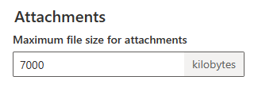
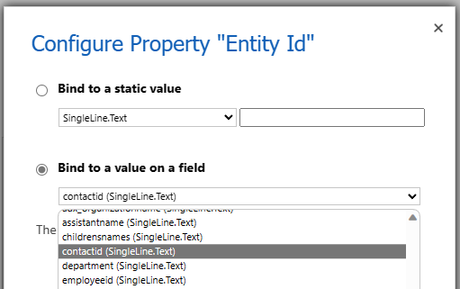
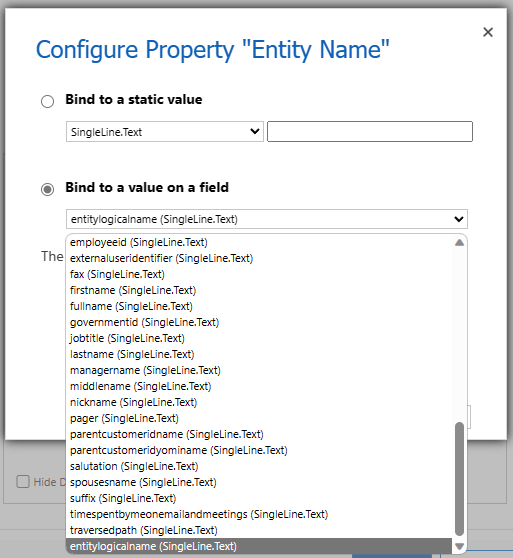
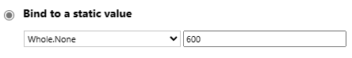
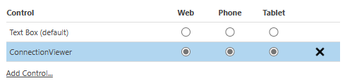
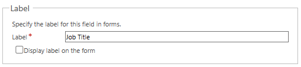

# How to set up

1. This PCF control works only on forms in model-driven apps. It doesn't work with canvas apps.
1. Download the latest solution file (.zip) from [Releases](https://github.com/keijiinouehotmail/DataverseConnectionViewerPCF/releases) of this repository.
1. In [https://make.powerapps.com/ ↗️](https://make.powerapps.com/) with a user who has the Customize permission, select an appropriate environment and import the solution file.
    - If you see an error like the following, you need to do additional settings.
      ```text
      Solution "Dataverse Connection Viewer PCF" failed to import: Import Solution Failed: CustomControl with name CV.ConnectionViewer failed to import with error: Webresource content size is too big.
      ```
    - Open [https://admin.powerplatform.microsoft.com/ ↗️](https://admin.powerplatform.microsoft.com/).
    - Click "Environments" on the left navigation, and select your environment.
    - Click "Settings" on the menu -> "Email" -> "Email settings"
    - In "Attachments", change "Maximum file size for attachments" from `5120` in default to `7000` or so.
    - 
    - Click "Save".
1. Display the screen to customize the form of any table (for example, "Contact").
1. Click "Switch to classic" on the menu to display the classic form editor.
1. On the form, place any text field where you want to display this PCF control.
    - Note that this field will not be changed by this PCF control.
    - Note that if you place the primary field, you will have trouble removing it from the form later, so it is recommended to place a field other than the primary field.
1. Double-click the field to display the field property window.
1. Click the `Controls` tab.
1. Click `Add Control...`.
1. Find "ConnectionViewer" and add it.
1. Set the following property group of "ConnectionViewer".
    - Entity Id
      - Click "Bind to a valu on a field" as shown in the following figure, and select the field that is the unique identifier of the target table.
      - 
      - For example, for the "Contact" table, select the `contactid` field.
    - Entity Name
      - Click "Bind to a value on a field" as shown in the following figure, and select the `entitylogicalname` field.
      - 
    - Height (px)
      - Specify the height in pixels of the area where this PCF control is displayed on the form.
      - For example, enter `600`.
      - 
    - Config Set
      - Enter the JSON-formatted text of which table data to visualize as a connection viewer.
      - By leaving the value blank without specifying it, the following settings will be applied as the default.
        ```json
        {
          "ConfigArray": [
            {
              "ID": "Sales",
              "Description": "This is a configuration for the sales department. Accounts and contacts, as well as opportunities as connection records.",
              "SmallerSizeEnabled": true,
              "DefaultCardsLayoutDescription": "Cards layout for sales department",
              "IsDefault": true,
              "EntitiesForConnectionList": [
                "account",
                "contact",
                "opportunity"
              ],
              "RelationshipSchemaNameList": [
                "contact_customer_accounts",
                "account_parent_account"
              ]
            },
            {
              "ID": "Service",
              "Description": "This is a configuration for the service department. This includes accounts, contacts, and cases.",
              "SmallerSizeEnabled": true,
              "DefaultCardsLayoutDescription": "Cards layout for service department",
              "IsDefault": false,
              "EntitiesForConnectionList": [
                "account",
                "contact",
                "incident"
              ],
              "RelationshipSchemaNameList": [
                "contact_customer_accounts",
                "account_parent_account",
                "incident_customer_accounts",
                "incident_customer_contacts"
              ]
            }
          ]
        }
        ```
      - Optionally, you can edit the JSON text above and enter the JSON text for this property with your own settings intended.
        - "ConfigArray"
          - Holds an array with objects representing multiple configuration information as elements. You can edit the elements of this array.
        - "ID"
          - Sets the ID of the configuration information.
        - "Description"
          - Sets the description text of the configuration information.
        - "SmallerSizeEnabled"
          - Sets the value true or false whether to use the feature to display the size of the card far from the card focused (by clicking, etc.) smaller.
        - "DefaultCardsLayoutDescription"
          - Sets the default text of the description to be attached to the saved card layout.
        - "IsDefault"
          - Sets the value true or false whether to use as the default configuration information among multiple configuration information in "ConfigArray".
        - "EntitiesForConnectionList"
          - Sets an array that holds the logical names of the tables that are the targets of the `connection` records to be displayed in the connection viewer.
        - "RelationshipSchemaNameList"
          - Sets an array that holds the schema names of the relationships that are the targets of the `1:N relationship`, `N:1 relationship`, or `N:N relationship` records to be displayed in the connection viewer.
        - ⚠️ Please note the presence or absence of commas "," when adding or deleting elements.
        - ⚠️ To check the schema name of the relationship, it is easy to use Metadata Tools.
          - [https://learn.microsoft.com/en-us/power-apps/developer/data-platform/browse-your-metadata ↗️](https://learn.microsoft.com/en-us/power-apps/developer/data-platform/browse-your-metadata)
      
    - Standalone Demo
      - Set whether to use the sample demo mode or not.
      - If you want to use the connection viewer using the sample data hard-coded in this PCF control, set `1`. If you want to use the actual data stored in Dataverse, set `0`.
    - Enable Node Scoring
      - Set `1` if you want to use the feature to score the strength of the connection between the cards displayed in the connection viewer, or `0` if not.
    - Azure OpenAI API Key
      - If you want to use the feature to ask questions about the cards displayed in the connection viewer and get answers using the ChatGPT API, set the Azure OpenAI API key.
      - If you do not want to use this feature, you do not need to set a value.
      - Also, if you want to use this feature, you need to specify the following Azure OpenAI API Endpoint URL.
    - Azure OpenAI API Endpoint URL
      - Set an Endpoint URL like the following.
        ```text
        https://{your-resource-name}.openai.azure.com/openai/deployments/{your-model-deployment-name}/completions?api-version=2023-07-01-preview
        ```
      - This is a valid setting if you specify the Azure OpenAI API Key described above.
1. After all the properties are set, for the `ConnectionViewer` control, check the Web, Phone, Tablet checkbox as shown in the following figure.
    - 
1. Click the `Display` tab in the field property window and uncheck the `Display label on the form` checkbox.
    - 
    - This setting is optional.
1. Click `OK` in the field property window to close it.
1. In the form editor, click `Save` and then click `Publish` to publish it.

## Attention
- It is not intended to place multiple of this PCF control on one form.
- It is assumed that the user will operate the mouse on a PC as a device. Touch interactions have not been tested.
- If you want to use the sample demo mode, that is, if you specify `1` for `Standalone Demo`, it is assumed that it is intended for tables that are used in Dynamics 365, not Dataverse alone.
- The default value in `Config Set` is also assumed to be intended for tables used in Dynamics 365.


