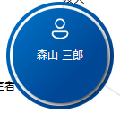
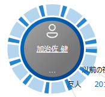

# ノードスコアリング

## スコア付けの概要

- この機能では、カードで表されるデータをノードと呼びます。  
- ある特定のノードに関する、他の多くのノードに与える影響度をスコアと呼びます。ここで特定のノードを "ソースノード"、他の多くのノードを "ターゲットノード" と呼びます。  
- 遠くのターゲットノードほど影響度は低くなります。  
- あるノードは隣接していて、かつ、ソースノードに近づかない位置にある他のターゲットノードに影響を与えます。  
- あるノードとあるノードの間に複数の関係性がある場合には、影響度は高くなります。  
- 同じノードであっても、コントロール上にどれだけのターゲットノードが展開されてるかによって、影響度は変わります。  

## ノードスコアリングの UI

- ソースノードのカードの外周のグラフィックスは以下です。
  - 
  - なお、その外周のグラフィックスが点滅している時は、スコアが算出された後にノードが追加されるなどして、スコアが変わっている可能性を示しています。
- ターゲットノードのスコアの大小に応じて、カードの外周のグラフィックスの幅が変わります。  
  - スコアが大きい
    - 
  - スコアが小さい
    - 
- ターゲットノードの外周の縞が強調表示されている場合、そのターゲットノードはソースノードからの同じ距離に位置するノードが通常シンプルに得られるスコアよりも高いスコアを得ていることを示します。
  - 通常よりも高いスコアを得ているノード
    - 
  - 通常のスコアを得ているノード
    - 