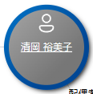
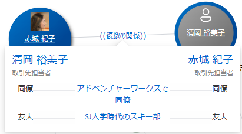
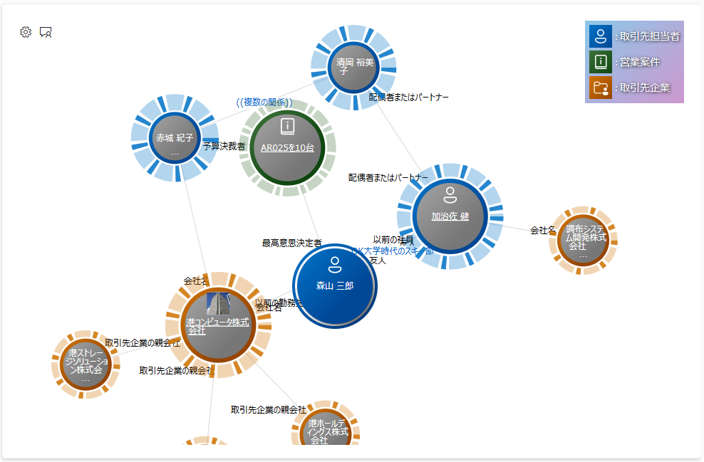
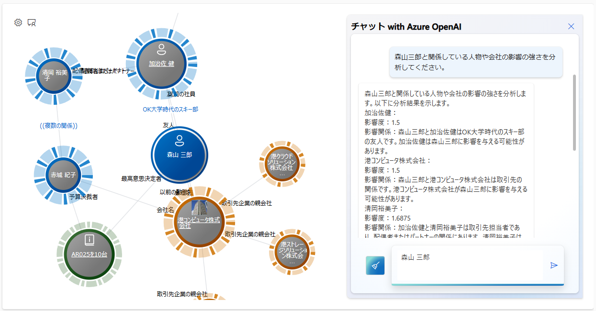
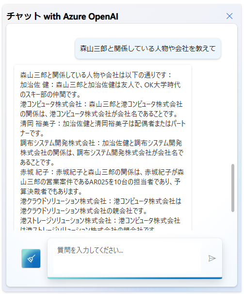
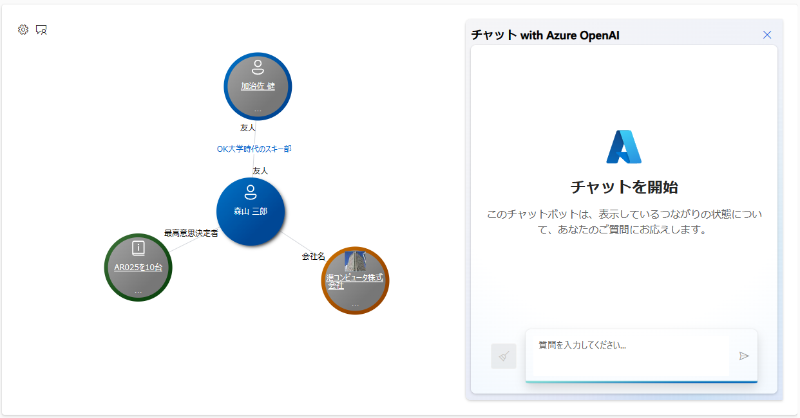
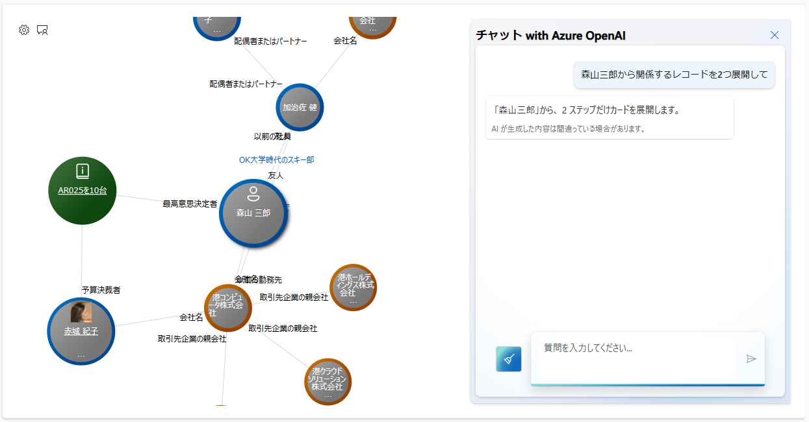

# Dataverse つながりビューワー PCF

[English is here](./README.md)

この PCF コントールは、 Dataerse に格納されている `つながり` (あるいは `接続`) データ、および `1:N`、 `N:1` あるいは `N:N` の関連データをビジュアルに表示するものです。


- PCF = [Power Apps component framework ↗️](https://learn.microsoft.com/ja-jp/power-apps/developer/component-framework/overview) です。
- 本 PCF コントロールは、モデル駆動型アプリのフォーム上でのみ動作します。キャンバス アプリでは動作しません。
- 本 PCF コントロールは、 [React コントロール ↗️](https://learn.microsoft.com/ja-jp/power-apps/developer/component-framework/react-controls-platform-libraries) として開発されています。
- 上記の画像を含む、サンプルデモ モードで表示されるデータは架空のものであり、実在するものとは関係ありません。

## 機能と使い方

- カードをクリックして長押しすると、固定表示され、動かなくなります。カードに影がつきます。
  - 
  - 再度長押しすると、固定表示が解除されます。
- カード間に青色文字列が表示されているものは、つながりを説明する文章などの情報です。クリックすると詳細が表示されます。
  - 
- **固定されているカード** 上で、アイコン部分にマウスカーソルをホバーすると、マウスアイコンが  に変わり、クリックするとそのカードと他のカードのつながりの強さを表すスコアを表現する UI が表示されます。
  - 
  - その状態で同領域をホバーすると、マウスアイコンが  に変わり、クリックすると UI が解除されます。
  - この機能は、セットアップ方法に記載のある `Enable Node Scoring` が有効になっている場合に利用できます。
  - この機能を "ノードスコアリング" 機能と呼びます。
- ギア アイコン  をクリックすると、オプションの設定ができます。
  - `コンフィグ`
    - [セットアップ方法](#セットアップ方法) で記載している `Config Set` の中から、利用するコンフィグを選択します。
  - `カードレイアウト`
    - 現在展開済みのカードレイアウトを保存したり、保存済のカードレイアウトを読み込んだりできます。
  - `リセット`
    - PCF コントロールが最初に読み込まれた状態にリセットします。
- チャット アイコン   をクリックすると、つながりビューワーで表示しているカード群に関して質問して、 Azure OpenAI の ChatGPT の API を呼び出して回答を得る機能を利用できます。
  - 想定された質問の種類は3種類です。以下にその種類と、例となる質問を示します。
    - analyze_impact_of_connections
      ```text
      森山三郎と関係している人物や会社の影響の強さを分析してください。
      ```
      - 
    - describe_connections
      ```text
      森山三郎と関係している人物や会社を教えて
      ```
      - 
    - expand_the_card_to_a_certain_distance
      ```text
      森山三郎から関係するレコードを2つ展開して
      ```
      - チャット前
        - 
      - チャット後
        - 
  - この機能を利用するには、 [セットアップ方法](#セットアップ方法) にて記載のある `Azure OpenAI API Key` および `Azure OpenAI API Endpoint URL` を設定する必要があります。
- カード中央の名称をクリックすると、そのレコードの詳細を表示するフォームが開きます。  

### 対応言語

- Dataverse を利用するユーザーとして設定している表示言語としては、 Dataverse がサポートしている言語であれば、どの言語でも利用できるはずです。
- 一方で、この PCF コントロールの UI 上のラベルで対応している言語としては、以下に対応しています。
  - 英語 (既定)
  - 日本語

### その他

- ユーザーが利用するデバイスとして、 PC でマウス操作することを想定しています。タッチ操作はテストしていません。
- カードレイアウト機能は、対象となるエンティティのプロパティで「メモ (添付ファイルを含む)」がオンになっている場合に利用できます。
- カードレイアウトを保存すると、フォームで表示されている Dataverse レコードに関連する新規のメモ レコードとして格納されます。本 PCF コントロールではそれを削除する機能は有していないため、削除を行う場合には、 Dataverse の標準的な機能を利用して、メモ レコードを削除してください。
- ノードスコアリング機能における UI など、詳細は、[こちら](./Docs/NodeScoring.ja.md) をご覧ください。

## セットアップ方法

こちら [セットアップ方法](./Docs/HowToSetUp.ja.md) をご覧ください。

## ビルド方法

こちら [ビルド方法](./Docs/HowToBuild.ja.md) をご覧ください。

## 利用している外部ライブラリ

- [https://github.com/microsoft/sample-app-aoai-chatGPT ↗️](https://github.com/microsoft/sample-app-aoai-chatGPT)
- [https://github.com/microsoft/fluentui-system-icons ↗️](https://github.com/microsoft/fluentui-system-icons)
- その他 `package.json` に記載しているもの
