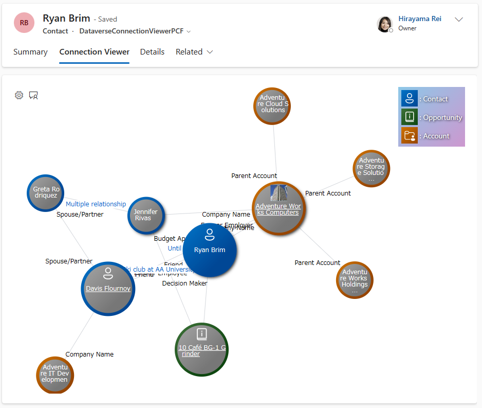
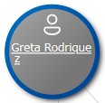
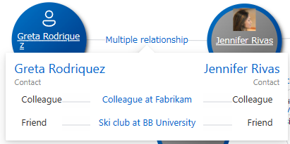
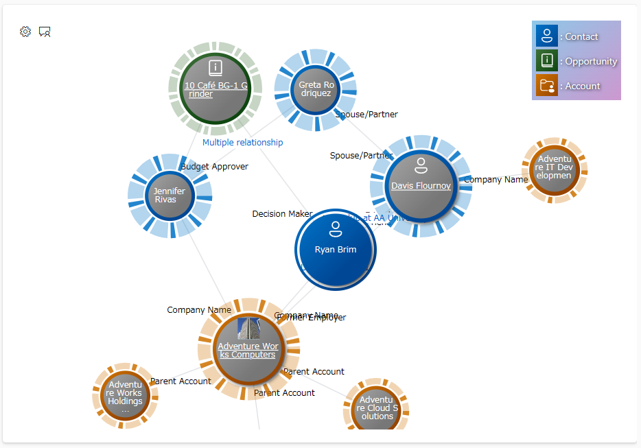
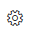
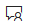
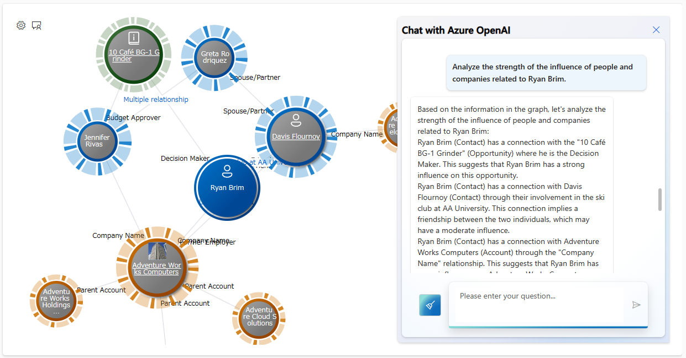
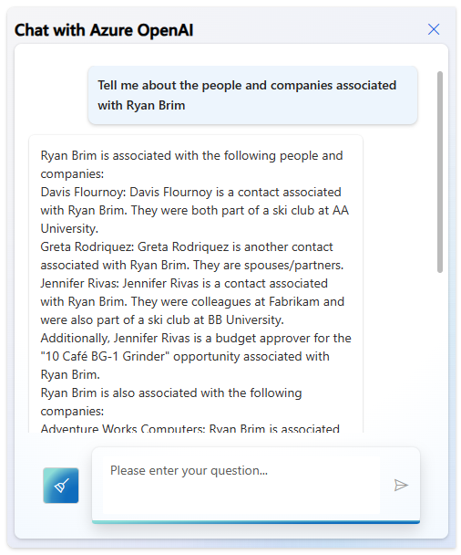
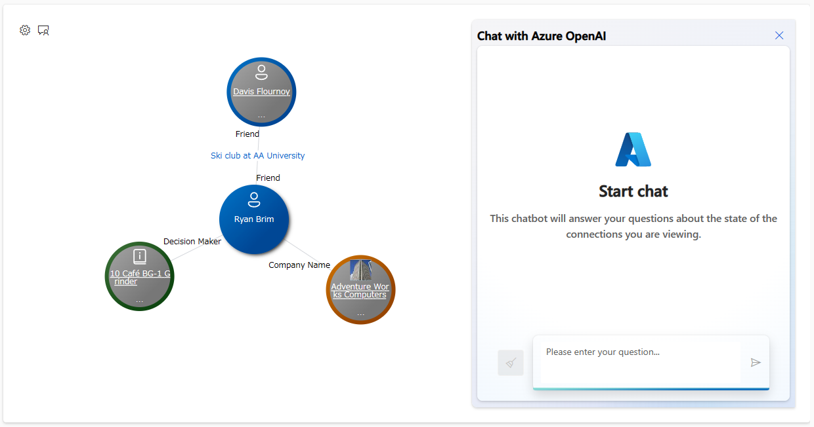
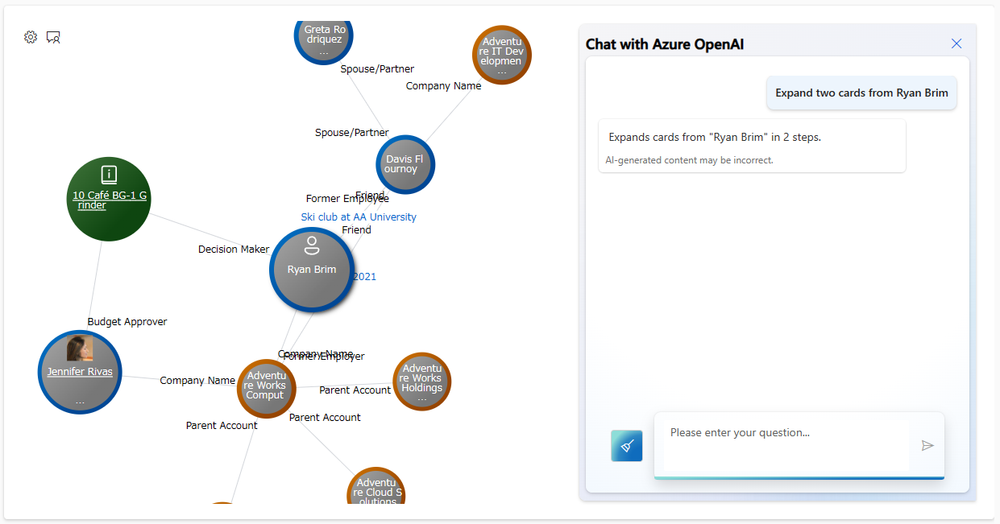

# Dataverse Connection Viewer PCF

[日本語はこちら (in Japanese)](./README.ja.md)

This PCF control provides a visual representation of the `connection` data stored in Dataerse and the related data of `1:N`, `N:1` or `N:N`.



- PCF = [Power Apps component framework ↗️](https://learn.microsoft.com/en-us/power-apps/developer/component-framework/overview) 
- This PCF control works only on forms in model-driven apps. It doesn't work with canvas apps.
- This PCF control was developed as a [React control ↗️](https://learn.microsoft.com/en-us/power-apps/developer/component-framework/react-controls-platform-libraries).
- The data displayed in the sample demo mode including the image above is fictitious and has nothing to do with real life.

## How to use

- Click and hold a card to pin it and get stuck. The card will be shadowed.
  - 
  - Press and hold again to release the pinned display.
- If you see a blue text between the cards, it's a sentence or other information that explains the connection. Click to see more details.
  - 
- **On a fixed card**, hover the mouse cursor over the icon area to change the mouse icon, and clicking displays a UI that represents a score that represents the strength of the connection between that card and other cards.
  - 
  - If you hover over the same area in that state, the mouse icon  and click to clear the UI.
  - This feature is available when 'Enable Node Scoring' is enabled as described in the setup instructions.
  - This feature is called the "Node Scoring" feature.
- Click the gear icon  to set options.
  - `Configs`
    - Select the config you want to use from the `Config Set` described in the [How to set up](#how-to-set-up).
  - `Cards layouts`
    - You can save a cards layout that is currently expanded, or you can import a saved cards layout.
  - `Reset`
    - Resets the PCF control to the state in which it was initially loaded.
- Click the chat icon  to ask questions about the cards you are viewing in the Connection Viewer and call Azure OpenAI's ChatGPT API to get answers.
  - There are three types of questions that are expected. Here are the types and some example questions:
    - analyze_impact_of_connections
        ```text
        Analyze the strength of the influence of people and companies related to Ryan Brim.
        ```
      - 
    - describe_connections
        ```text
        Tell me about the people and companies associated with Ryan Brim
        ```
      - 
    - expand_the_card_to_a_certain_distance
        ```text
        Expand two cards from Ryan Brim
        ```
      - Before the chat
        - 
      - After the chat
        - 
    - To use this feature, you need to set the `Azure OpenAI API Key` and `Azure OpenAI API Endpoint URL` described in the [How to set up](#how-to-set-up).
- Click the name in the center of the card to open a form that displays the details of that record.  

### Supported Languages

- As for the display language that a user set to use Dataverse, this PCF control should be able to use any language that Dataverse supports.
- On the other hand, the following languages are supported by the labels on the UI of this PCF control:
  - English (default)
  - Japanese

### Miscellaneous

- It is assumed that the user will operate the mouse on a PC as a device. Touch interactions have not been tested.
- The card layout feature is available when "Notes (or annotation) (including attachments)" is turned on in the properties of the target entity.
- When you save a card layout, it's stored as a new note (annotation) record that is related to the Dataverse record that's displayed in the form. This PCF control does not have the ability to delete it, so if you want to delete it, please use the standard functionality of Dataverse to delete the note record.
- For more information, including the UI for the node scoring feature, see [here](./Docs/NodeScoring.md).

## How to set up

See [How to set up](./Docs/HowToSetUp.md).

## How to build

See [How to build](./Docs/HowToBuild.md).

## External libraries used

- [https://github.com/microsoft/sample-app-aoai-chatGPT ↗️](https://github.com/microsoft/sample-app-aoai-chatGPT)
- [https://github.com/microsoft/fluentui-system-icons ↗️](https://github.com/microsoft/fluentui-system-icons)
- Other libraries listed in `package.json`


