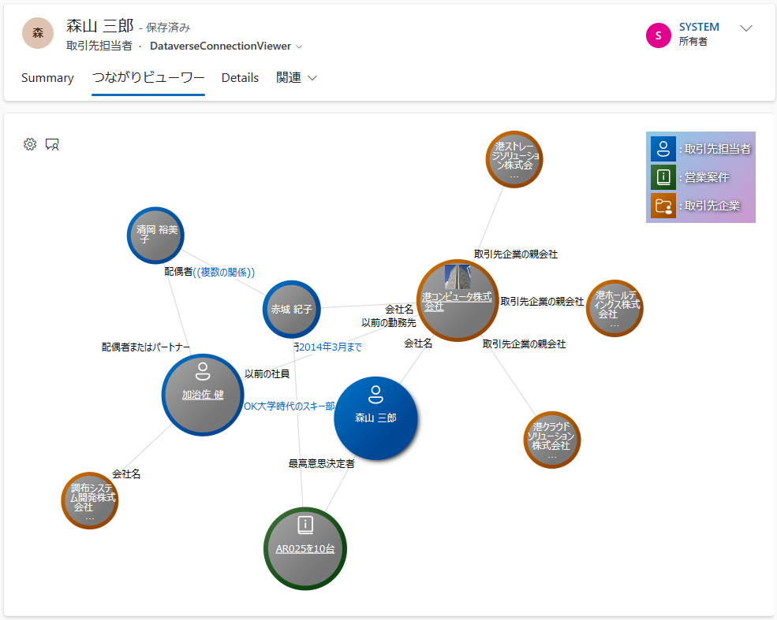

# Dataverse Connection Viewer PCF

[日本語はこちら (in Japanese)](./README.ja.md)

This PCF control provides a visual representation of the `connection` data stored in Dataerse and the related data of `1:N`, `N:1` or `N:N`.

- PCF = [Power Apps component framework (external site)](https://learn.microsoft.com/en-us/power-apps/developer/component-framework/overview) 
- This PCF control works only on forms in model-driven apps. It doesn't work with canvas apps.
- This PCF control was developed as a [React control (external site)](https://learn.microsoft.com/en-us/power-apps/developer/component-framework/react-controls-platform-libraries).
- The data displayed in the sample demo mode including the image above is fictitious and has nothing to do with real life.

## How to use

This section is a work in progress.

### Attention

- It is assumed that the user will operate the mouse on a PC as a device. Touch interactions have not been tested.
- The card layout feature is available when "Notes (or annotation) (including attachments)" is turned on in the properties of the target entity.
- When you save a card layout, it's stored as a new note (annotation) record that is related to the Dataverse record that's displayed in the form. This PCF control does not have the ability to delete it, so if you want to delete it, please use the standard functionality of Dataverse to delete the note record.
- For more information, including the UI for the node scoring feature, see [here](./Docs/NodeScoring.md).

## How to set up

See [How to set up](./Docs/HowToSetUp.md).

## How to build

See [How to build](./Docs/HowToBuild.md).

## External libraries used

- [https://github.com/microsoft/sample-app-aoai-chatGPT (external site)](https://github.com/microsoft/sample-app-aoai-chatGPT)
- [https://github.com/microsoft/fluentui-system-icons (external site)](https://github.com/microsoft/fluentui-system-icons)
- Other libraries listed in `package.json`

